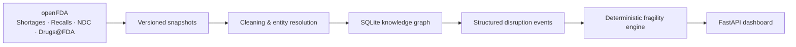

# MediSupply AI

**Pharmaceutical supply-chain intelligence built from real FDA data—designed to help analysts see where shortages, recalls, manufacturer concentration, and fragile alternatives intersect.**

[](https://www.python.org/)
[](medisupply/reports/production_application.md)
[](LICENSE)

Drug-supply data is abundant but fragmented. A shortage record can name a product differently from the NDC Directory; recalls may omit usable identifiers; a single real-world incident can appear under hundreds of recall filings; and the reason text needed to explain a disruption is often missing altogether.

MediSupply AI turns those disconnected records into an evidence-backed intelligence layer. It ingests four openFDA datasets, resolves product and manufacturer identities, builds a queryable knowledge graph, classifies disruption causes, and calculates transparent fragility scores. The result is a lightweight dashboard where an analyst can ask:

> Who else makes this active ingredient—and are those alternatives also in shortage or under recall?

The production dashboard itself is deterministic: it makes **no AI calls**. Model-generated labels are stored, validated, versioned inputs; risk scores are plain Python calculations with visible component weights.

> [!IMPORTANT]
> MediSupply AI is a **research and analyst-support tool**, not medical or clinical advice. Its outputs require human review and should be verified against current FDA and operational sources before decisions are made.

## What it does



- Pulls complete, paginated snapshots from four openFDA drug endpoints.
- Normalizes NDCs, manufacturers, generic names, and brands across messy source data.
- Connects products to manufacturers, ingredients, applications, shortages, recalls, sponsors, and proxy-equivalent alternatives.
- Preserves a 400-record, human-reviewed gold set for honest evaluation.
- Uses incident-aware grouping and weighting so repeated recall filings do not masquerade as independent evidence.
- Scores current shortages from explainable factors: manufacturer concentration, duration, overlapping recalls, alternative availability, and structured root cause.
- Presents ranked supply-chain research signals with explicit confidence and “requires human review” framing.

## The journey, phase by phase

| Phase | What changed |
|---|---|
| **3 · FDA ingestion** | Pulled shortages, enforcement recalls, NDC Directory, and Drugs@FDA records with pagination and durable JSON output. |
| **4 · Snapshots and change detection** | Replaced one-time downloads with timestamped snapshots and diffs for new/resolved shortages, recalls, and changed FDA fields. |
| **5 · Cleaning and entity resolution** | Normalized NDC formats and manufacturer names, enriched drug names from the NDC Directory, and began measuring join quality rather than assuming it. |
| **6 · Knowledge graph** | Built queryable SQLite relationships among manufacturers, products, NDCs, ingredients, shortages, recalls, applications, sponsors, and equivalent-product candidates. |
| **7 · Event schema** | Defined the validated `DisruptionEvent` contract: primary cause, secondary causes, supply-chain stage, severity, and verbatim evidence. |
| **8 · Rule baseline and taxonomy audit** | Built a deliberately simple regex classifier, found its failure modes, and expanded the taxonomy to 13 causes grounded in FDA text. |
| **9 · Human gold dataset** | Stratified and manually reviewed 400 real shortage/recall records, preserving hard collisions and rare categories instead of letting the majority class dominate. |
| **10 · Teacher labeling** | Used Claude behind strict JSON/evidence validation and cost gates. Missing/`Other` shortage reasons were assigned deterministic `unknown` labels without paid calls. |
| **11 · Small-model distillation** | Fine-tuned Qwen2.5-1.5B with LoRA as a local feasibility experiment, then evaluated it against the untouched 400-record gold set. |
| **12 · Incident-aware modeling** | Detected extreme recall duplication and added `incident_id`, `reason_text_id`, leakage-safe grouped splits, and inverse-frequency weighting. |
| **13 · Intelligence engine** | Added transparent 0–100 supply-fragility calculations and validated the traversal on a real lisdexamfetamine shortage/recall case. |
| **14 · Production application** | Built a read-only FastAPI dashboard with ranked shortages, filters, detailed score components, provenance-aware unknown labels, and confidence warnings. |

The free daily pipeline now runs ingestion → cleaning → graph rebuild → intelligence recalculation → atomic dashboard refresh. Paid teacher labeling is deliberately excluded from unattended automation.

## Findings that changed the project

### 1. `recall` was not a safe fallback

The first baseline used `primary_cause: "recall"` when recall text matched no keyword rule. That looked harmless, but it confused an event type with a causal finding. Across the full recall dataset, **276 records** hit that pure fallback path; during human review, the first **5/5 were wrong**, spanning regulatory noncompliance, labeling/packaging errors, and manufacturing-quality problems.

The fix was simple but important: zero-match records now fall back to `unknown`, while `recall` is reserved for text that genuinely establishes a recall whose cause falls outside the taxonomy. The original Phase 9 candidate suggestions remain frozen, so the gold evaluation still measures the old baseline honestly.

### 2. Most recall rows were not independent examples

Exact duplicate `reason_for_recall` text affects **14,619 of 17,876 filings (81.78%)**. One phrase—“Lack of Assurance of Sterility”—appears 1,902 times across 116 FDA events; other large groups are hundreds of filings from a single incident.

Training or splitting by raw row would leak incidents across train and test and let a few events dominate learning. MediSupply therefore groups by FDA `event_id` and normalized `reason_text_id`, keeps connected groups in one split, and weights repeated event/text filings down. The 17,876 raw recall rows reduce to **5,418 event+text modeling units** before later filtering.

Read the full audit in [the Phase 12 data-quality report](medisupply/reports/phase12_data_quality.md).

### 3. Bigger was better—but the small model exposed the real data limit

All three classifiers were evaluated against the same 400 human-labeled records:

| Classifier | Gold-set accuracy | Honest interpretation |
|---|---:|---|
| Rule-based baseline | **79.25%** | Strong on standardized phrases, brittle on paraphrases and boundaries. |
| Claude teacher | **95.50%** | Best overall result; still confused several temperature-abuse and packaging/quality boundaries. |
| Qwen2.5-1.5B QLoRA | **67.50%** overall | Feasibility proof, not a teacher replacement. |
| Qwen2.5-1.5B on its 3 trained categories | **90.28%** | Promising where supervision existed; unsupported elsewhere. |

The distilled model was leakage-safe but trained on only **3 of 13 categories**. Its low overall score is not a deployment failure disguised as success—it is evidence that architecture cannot substitute for balanced, incident-independent labels.

See [the complete distillation report](medisupply/reports/phase11_distillation.md) for category-level accuracy, invalid-output rates, training time, latency, and footprint.

## Current data snapshot

The included reports describe snapshot `2026-08-21_17` and will change when the pipeline is rerun.

- **1,628** FDA shortage records; **1,451 (89.13%)** linked to an NDC product.
- **17,876** recall filings; **3,484 (19.49%)** linked to a product overall.
- Recall linkage reaches **100% when FDA supplies harmonized identifiers**; older identifier-poor recalls remain a major confidence limitation.
- **137,206** drug products, **390,016** NDC nodes, **7,694** normalized active ingredients, and **29,749** drug applications in the graph.
- FDA supplied no `shortage_reason` for **1,205 of 1,628 shortages (74.02%)**. Those reasons remain null; operational/discontinuation context is kept separately rather than invented as a cause.

Detailed audits live in [`medisupply/reports/`](medisupply/reports/):

- [Cleaning and entity-resolution quality](medisupply/reports/data_quality.md)
- [Knowledge-graph quality and worked traversals](medisupply/reports/knowledge_graph_quality.md)
- [Rule-baseline audit](medisupply/reports/baseline_classifier_quality.md)
- [Teacher-labeling quality](medisupply/reports/teacher_labeling_quality.md)
- [Incident-aware data audit](medisupply/reports/phase12_data_quality.md)
- [Intelligence-engine results](medisupply/reports/intelligence_engine.md)
- [Production dashboard](medisupply/reports/production_application.md)

## Run locally

### Prerequisites

- macOS or Linux
- Python **3.11**
- Enough disk space for the full openFDA snapshots and processed graph
- Internet access for ingestion
- Optional: an openFDA API key for higher API limits

The project currently uses a manual Python/Conda setup. **Docker support has not been added yet**; when it is, the container workflow should become the recommended quick start.

### 1. Create the environment

From the repository root:

```bash
cd medisupply

conda create -n medisupply python=3.11 -y
conda activate medisupply

python -m pip install \
  -r requirements-phase14.txt \
  pydantic==2.13.4 \
  pytest==9.1.1 \
  ruff
```

Optional configuration:

```bash
export OPENFDA_API_KEY="your-openfda-key"
```

An Anthropic key is **not** required for ingestion, cleaning, graph construction, risk scoring, or the dashboard. Do not configure or run teacher labeling unless you intentionally want to make paid API calls.

### 2. Build the data pipeline

Run each free stage in order:

```bash
python src/ingestion/run_ingestion.py
python src/cleaning/run_cleaning.py
python src/graph/build_graph.py
python scripts/run_intelligence_engine.py --top 15
python scripts/refresh_dashboard_data.py
```

Each ingestion creates a timestamped snapshot under `data/snapshots/`. Cleaning and graph construction write snapshot-matched processed artifacts; the final command validates and atomically promotes dashboard data, so a failed run cannot replace the last known-good dashboard artifact.

### 3. Start the dashboard

```bash
python -m uvicorn src.api.app:app --host 127.0.0.1 --port 8000
```

Open [http://127.0.0.1:8000](http://127.0.0.1:8000). API documentation is available at [http://127.0.0.1:8000/api/docs](http://127.0.0.1:8000/api/docs).

### 4. Run the tests

```bash
python -m pytest -q
```

### Optional: daily automation

[`scripts/run_daily_ingestion.sh`](medisupply/scripts/run_daily_ingestion.sh) runs the complete free pipeline, fails fast, writes per-stage logs, and promotes dashboard data only after validation. Update its project and Python paths for your machine before scheduling it. The current macOS cron configuration is documented in [the daily pipeline guide](medisupply/reports/daily_pipeline.md).

## Project layout

```text
medisupply/
├── src/
│   ├── ingestion/       # openFDA pulls, snapshots, and change detection
│   ├── cleaning/        # normalization and entity resolution
│   ├── graph/           # SQLite schema, build, and traversal queries
│   ├── models/          # event schema, rules, gold/teacher/modeling logic
│   ├── intelligence/    # deterministic fragility calculations
│   └── api/             # FastAPI backend and lightweight HTML/JS UI
├── scripts/             # reproducible phase entry points and daily pipeline
├── data/                # snapshots, labels, modeling artifacts, promoted UI data
├── reports/             # human-readable and machine-readable quality reports
├── configs/             # Qwen/LoRA experiment configurations
└── tests/               # unit, integration, and pipeline-safety coverage
```

## Honest limitations

- **Teacher labeling is partial by design.** Phase 10 stopped under an explicit cost ceiling. The saved corpus contains **2,263 Claude-labeled** and **1,339 deterministic unknown-policy** records, while **3,098 model calls remain**—primarily recall event/text units. Every non-gold shortage with a real FDA reason was completed; recalls remain partial.
- **The distilled model is a feasibility experiment.** Qwen2.5-1.5B was trained on a leakage-safe subset covering only `manufacturing_quality_problem`, `labeling_packaging_error`, and `regulatory_noncompliance`. It is not a complete 13-category classifier and is not used as the production decision layer.
- **Several categories lack independent support.** `adverse_event_signal`, for example, has 40 gold rows but only one incident and one unique reason text. `manufacturing_capacity` has no human-gold examples. More duplicate filings do not solve that problem; new independent incidents do.
- **Recall linkage is incomplete.** Overall product linkage is 19.49% because many historical FDA recall records lack usable NDC/application identifiers. A negative overlap is therefore explicitly labeled limited-confidence.
- **Equivalent products are proxies.** In the absence of Orange Book data, alternatives use the same active-ingredient set, strength, dosage form, and route. They are candidates—not FDA-rated therapeutic-equivalence determinations.
- **A fragility score is not a forecast.** The score describes observable conditions in one snapshot. It does not estimate patient harm, clinical substitutability, inventory on hand, or the probability of a future shortage.

## Responsible use

MediSupply AI is intended for supply-chain research, data-quality investigation, and analyst triage. It should help a human find the right records faster—not replace pharmacists, clinicians, manufacturers, regulators, procurement teams, or current source verification.

Do not use the dashboard to make treatment decisions, recommend substitutions, or infer that a drug is clinically interchangeable or currently available at a particular location.

## License

MediSupply AI is available under the [MIT License](LICENSE).

